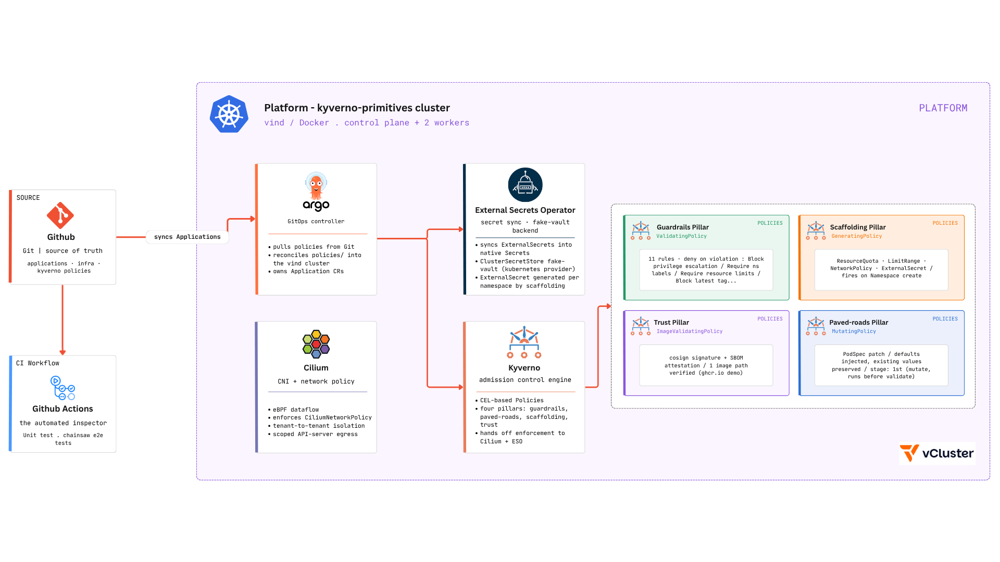

# kyverno-platform-primitives

Kyverno used as a platform primitive rather than only a security gate: one policy engine doing four jobs (validate, mutate, generate, verify images), delivered through GitOps, tested at two levels, and validated by CI on every push.



## Why this project

Most Kyverno setups use only one of its four capabilities, `validate`, and treat it as a gate that says no. The CNCF post [Kyverno is a platform primitive, not a security tool](https://www.cncf.io/blog/2026/08/19/kyverno-is-a-platform-primitive-not-a-security-tool/) (Koray Oksay, August 2026) which served as inspiration for this project argues that only `validate` fits that model. The other three verbs are constructive:

| Verb | Role in this project | Pillar |
|---|---|---|
| validate | Guardrails: reject what is unsafe | `guardrails` |
| mutate | Paved roads: fix what can be fixed safely | `paved-roads` |
| generate | Scaffolding: furnish every new namespace | `scaffolding` |
| verify images | Trust: only run what is signed and attested | `trust` |

This repo is structured around that taxonomy. Every policy is written in Kyverno's CEL-based policy types (`ValidatingPolicy`, `MutatingPolicy`, `GeneratingPolicy`, `ImageValidatingPolicy`), since `ClusterPolicy` is deprecated as of Kyverno 1.19 with removal planned for 1.20 (estimated at Nov 2026).

## Architecture

A push to Git triggers two independent paths that read the same source of truth:

- **GitHub Actions** runs the unit tests and the Chainsaw end-to-end tests on PR.
- **ArgoCD** syncs `policies/` into a long-lived vind cluster (1 control plane + 2 workers) when PR are merged to main.

Inside the cluster, Kyverno enforces the four pillars and hands off to two downstream systems: **Cilium** enforces the NetworkPolicy that scaffolding generates, and the **External Secrets Operator** syncs the ExternalSecret that scaffolding generates.

### Admission order

Kubernetes runs mutating admission webhooks before validating ones. This is inherent to the admission chain, not something configured here, but it shapes the design: `paved-roads` policies run first and silently fix most manifests, so `guardrails` only fire on what could not be safely patched. The registry allowlist guardrail is a safety net behind the image-rewrite mutation, not the primary mechanism.

## The four pillars

### Guardrails (validate, `ValidatingPolicy`)

| Policy | Enforces |
|---|---|
| `require-resource-limits` | CPU and memory requests and limits on every container |
| `disallow-latest-tag` | Explicit, non-`latest` image tags |
| `require-namespace-labels` | Non-empty `team` and `environment` labels |
| `block-privilege-escalation` | `allowPrivilegeEscalation: false` |
| `require-readonly-rootfs` | `readOnlyRootFilesystem: true` |
| `restrict-image-registries` | Images only from an approved registry list |
| `require-pod-securitycontext` | Pod-level `runAsNonRoot: true` |
| `block-hostpath-volumes` | No `hostPath` volumes |
| `block-hostnetwork` | No `hostNetwork` set to `true` |
| `block-host-pid-ipc` | No `hostPID` or `hostIPC` set to `true` |
| `restrict-secret-creation` | Raw Secrets can only be created by the ESO controller identity |

### Paved roads (mutate, `MutatingPolicy`)

| Policy | Does |
|---|---|
| `default-resource-limits` | Injects default requests and limits when a container has none |
| `default-security-context` | Injects safe container and pod securityContext defaults when missing |

### Scaffolding (generate, `GeneratingPolicy`)

Fires when a namespace is created. Infrastructure namespaces (`kube-system`, `kyverno`, `argocd`, `external-secrets`, `secret-backend`, and similar) are excluded, since a default-deny NetworkPolicy there would break the cluster's own components.

| Policy | Generates |
|---|---|
| `generate-resource-quota` | A default ResourceQuota |
| `generate-limit-range` | A default LimitRange (values match the paved-roads defaults) |
| `generate-default-deny-networkpolicy` | A default-deny NetworkPolicy |
| `generate-external-secret` | An ExternalSecret bound to the `fake-vault` ClusterSecretStore |

### Trust (verify images, `ImageValidatingPolicy`)

`verify-signed-images` requires two things for images under the demo registry path: a valid cosign signature, and a signed CycloneDX SBOM attestation. Verification is key-based (public key embedded in the policy).

Producing a verifiable image:

```bash
cosign generate-key-pair
cosign sign --key cosign.key <registry>/<owner>/<image>:<tag>
syft <registry>/<owner>/<image>:<tag> -o cyclonedx-json > sbom.json
cosign attest --key cosign.key --predicate sbom.json --type cyclonedx <registry>/<owner>/<image>:<tag>
```

## How Secrets flow in this setup ?

Scaffolding and guardrails work together on secrets. A new namespace gets an ExternalSecret generated for it. The External Secrets Operator resolves it against the `fake-vault` ClusterSecretStore (the `kubernetes` provider, backed by a dummy Secret in the `secret-backend` namespace) and materializes a real Secret. Meanwhile `restrict-secret-creation` denies everyone except the ESO controller from creating Secrets directly, so ESO is the only path.

## Testing

Two layers:

- **Unit tests** (`kyverno test`): each policy's logic against fixtures, in isolation and without a cluster.
- **End-to-end tests** (Chainsaw): behavior on a real cluster, including the final spec of a mutated pod, the resources generated on namespace creation, and the rejection of an unsigned image.

Mutation and generation policies are tested on their actual output, not only on pass or fail.

## Another Demo

Aside from the tests carried out by the CI workflow, we also have a demo file with 10 cases that mirrors the four pillars to be applied on your local live cluster
, which can be found the `/demo` directory. 

## Reproducing it

This project was built and tested on WSL2 + Docker Desktop, which has its own set of networking quirks. A full walkthrough and further explanations of that setup is written up here (Article will be up soon - will be replaced by the link !).

## Future work


- Add a `PolicyException` for a deliberate break-glass case.
- Scan the demo image with grype or trivy using the SBOM already produced.

## Related

- [Project 1](https://github.com/GHARBIyasmine/gitops-platform-demo): GitOps platform with nested vClusters, ArgoCD app-of-apps, and Cilium network policies.
- [Kyverno is a platform primitive, not a security tool](https://www.cncf.io/blog/2026/08/19/kyverno-is-a-platform-primitive-not-a-security-tool/), the CNCF post this project is built around.
